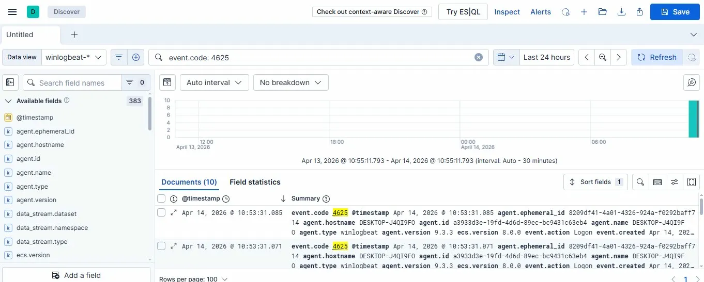
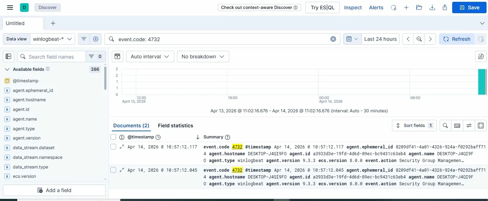
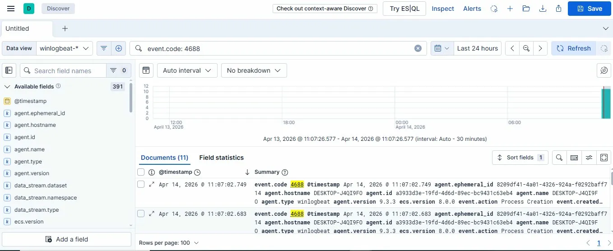

# SIEM Home Lab — Elastic Stack on Windows 10

A home security operations lab built on Elastic Stack (Elasticsearch + Kibana + Winlogbeat), ingesting real-time Windows Security event logs and detecting attacker behaviors mapped to MITRE ATT&CK.

---

## Architecture

```
Windows 10 Host
│
├── Winlogbeat 9.3.3
│   └── Collects: Security, System, Application event logs
│
├── Elasticsearch 9.3.3
│   └── Indexes and stores all log data locally
│
└── Kibana 9.3.3
    └── Dashboards, KQL search, detection rules, alerting
```

---

## Environment

| Component | Version | Role |
|---|---|---|
| OS | Windows 10 | Log source + host |
| Elasticsearch | 9.3.3 | Log storage and indexing |
| Kibana | 9.3.3 | SIEM UI, dashboards, alerting |
| Winlogbeat | 9.3.3 | Log collection agent |

---

## Log Sources Ingested

- **Windows Security log** — authentication, privilege use, account changes, process creation
- **Windows System log** — service starts/stops, system events
- **Windows Application log** — application errors and events

| Event ID | Description | MITRE ATT&CK |
|---|---|---|
| 4624 | Successful logon | T1078 Valid Accounts |
| 4625 | Failed logon | T1110 Brute Force |
| 4634 | Logoff | T1078 Valid Accounts |
| 4672 | Special privileges assigned | T1078.002 |
| 4688 | Process creation | T1059 Command Execution |
| 4728 | User added to global group | T1098 Account Manipulation |
| 4732 | User added to local group | T1098 Account Manipulation |
| 4776 | NTLM credential validation | T1110 Brute Force |

---

## Detection Rules (KQL)

### 1. Brute Force Detection

    event.code: 4625

Detects repeated failed logon attempts. Tuned with a threshold of 5+ failures in 2 minutes from the same source.



---

### 2. Privilege Escalation — User Added to Admin Group

    event.code: 4732

Detects when any account is added to a privileged local group. Any alert here warrants immediate investigation.



---

### 3. Process Creation Monitoring

    event.code: 4688

Refined version for suspicious reconnaissance:

    event.code: 4688 AND process.command_line: ("whoami" OR "ipconfig" OR "net user" OR "net localgroup")



---

### 4. Special Privilege Logon

    event.code: 4672 AND NOT winlog.event_data.SubjectUserName: "SYSTEM"

Detects non-SYSTEM accounts granted special privileges — a key indicator of privilege escalation or lateral movement.

---

## Test Activity Generated

**Simulate brute force (10 failed logons):**

    for ($i=1; $i -le 10; $i++) {
      $cred = New-Object System.Management.Automation.PSCredential("fakeuser", (ConvertTo-SecureString "wrongpassword" -AsPlainText -Force))
      Start-Process cmd -Credential $cred -ErrorAction SilentlyContinue
    }

Result: 10 x Event ID 4625 captured in Kibana

**Simulate privilege escalation:**

    net user testuser Password123! /add
    net localgroup administrators testuser /add
    net user testuser /delete

Result: 2 x Event ID 4732 captured in Kibana

**Enable process creation auditing:**

    auditpol /set /subcategory:"Process Creation" /success:enable /failure:enable

**Simulate post-compromise reconnaissance:**

    Start-Process powershell -ArgumentList "-Command whoami; ipconfig; net user" -WindowStyle Hidden

Result: 11 x Event ID 4688 captured in Kibana

---

## Key Findings

- Windows machines generate continuous authentication and privilege events even at idle — establishing a baseline is critical before tuning detection thresholds
- Event ID 4688 requires manual audit policy enablement via auditpol — not on by default
- Winlogbeat ships logs in near-real-time (~15 second delay), making it viable for live threat detection

---

## Certifications and Context

Built as hands-on supplement to CompTIA Security+ (SY0-701), covering:

- Domain 1 — Threats, Attacks and Vulnerabilities (brute force, privilege escalation)
- Domain 2 — Technologies and Tools (SIEM configuration, log analysis)
- Domain 4 — Identity and Access Management (Event ID mapping)

---

## Next Steps

- [ ] Add Packetbeat for network traffic ingestion
- [ ] Build Kibana alerting rules with email notifications
- [ ] Integrate MITRE ATT&CK Navigator overlay
- [ ] Add Linux VM with auth log ingestion

---

## References

- [Elastic Security Documentation](https://www.elastic.co/guide/en/security/current/index.html)
- [MITRE ATT&CK Framework](https://attack.mitre.org/)
- [Windows Security Event IDs](https://docs.microsoft.com/en-us/windows/security/threat-protection/auditing/security-auditing-overview)
- [CompTIA Security+ SY0-701](https://www.comptia.org/certifications/security)
